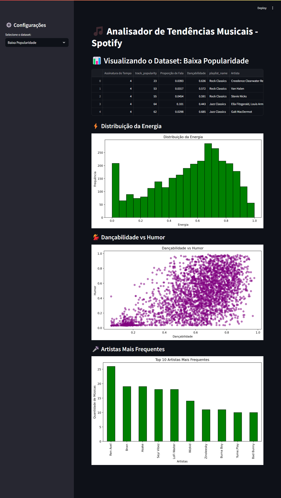

# Social Trends Analyzer

## Descrição

O **Social Trends Analyzer** é um projeto em Python criado para analisar tendências e sentimentos em dados públicos de redes sociais. Utilizamos ferramentas poderosas como Pandas para manipulação de dados, bibliotecas de NLP (Processamento de Linguagem Natural) para análise de sentimentos, e visualizações interativas para apresentar os resultados.

## 🎯 Objetivo

Fornecer insights valiosos sobre tópicos populares, hashtags ou termos amplamente discutidos em redes sociais, utilizando datasets públicos disponíveis no Kaggle, Google Trends e outras fontes.

## ✨ Funcionalidades

- 📥 Importação e limpeza de dados públicos (CSV/JSON).
- 📊 Análise de tendências e frequências de termos.
- 😊 Análise de sentimento (positivo, negativo ou neutro).
- 📈 Visualização de dados em gráficos interativos.

## 🛠️ Tecnologias Utilizadas

- **Python**: Linguagem principal para análise e processamento.
- **Pandas**: Manipulação e análise de dados.
- **Matplotlib/Seaborn**: Visualizações gráficas.
- **Streamlit**: Interface gráfica interativa.

## 📂 Estrutura do Projeto

- `/src`: Código-fonte do projeto.
  - `main.py`: Arquivo principal que executa o Streamlit e conecta os módulos.
  - `data_loader.py`: Responsável pelo carregamento e pré-processamento dos datasets.
  - `visualizations.py`: Responsável pela criação de gráficos.
- `/data`: Datasets utilizados para análise.
- `/docs`: Documentação adicional.
- `/visualizations`: Gráficos gerados durante o processo de análise.
- `/assets`: Contém imagens e recursos visuais.

## 🚀 Como Usar

1. Clone o repositório:

   ```bash
   git clone https://github.com/seu-usuario/social-trends-analyzer.git
   ```

2. Navegue até o diretório do projeto:

   ```bash
   cd social-trends-analyzer
   ```

3. Instale as dependências:

   ```bash
   pip install -r requirements.txt
   ```

4. Execute o aplicativo:
   ```bash
   streamlit run src/main.py
   ```

## 🖼️ Exemplo de Uso

O aplicativo permite explorar dados de músicas de alta e baixa popularidade no Spotify. Ele oferece:

- ⚡ Visualização da distribuição da energia das músicas.
- 💃 Análise da relação entre dançabilidade e humor.
- 🎤 Listagem dos artistas mais frequentes no dataset.

### Imagem do Aplicativo



## 🔮 Próximos Passos

- 📊 Integrar novos datasets públicos para expandir as análises.
- 🛠️ Adicionar mais funcionalidades interativas na interface gráfica.
- 🤖 Automatizar atualizações de dados utilizando fontes online.

---

**Autor:** [Victor Beal]  
**Repositório:** [Repositório do Projeto no GitHub](https://github.com/vbeal?tab=repositories)  
**LinkedIn:** [Meu LinkedIn](https://www.linkedin.com/in/victorbeal)
